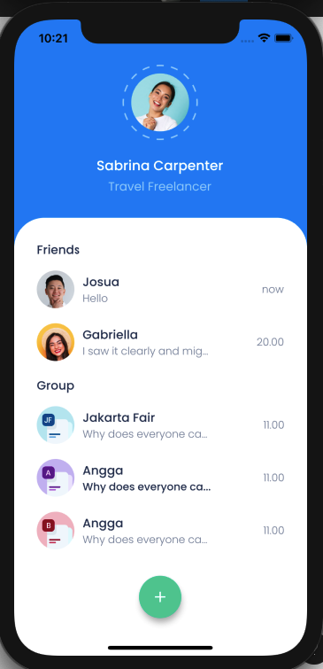

# Flutter Design App

## Description

Simple project Flutter Design

## 1. Chatty App



`change main.dart to this`

```dart
import 'package:flutter/material.dart';
import 'package:my_app/home_chatty.dart';

void main() {
  runApp(MyApp());
}

class MyApp extends StatelessWidget {
  // This widget is the root of your application.
  @override
  Widget build(BuildContext context) {
    return MaterialApp(
      debugShowCheckedModeBanner: false,
      theme: ThemeData(fontFamily: 'Poppins'),
      home: HomeChatty(),
    );
  }
}

```
